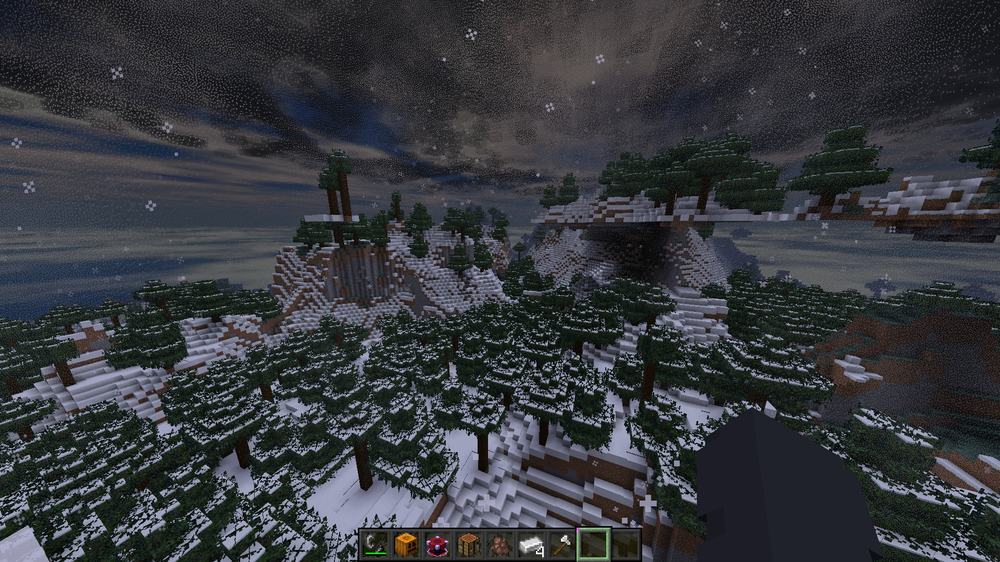
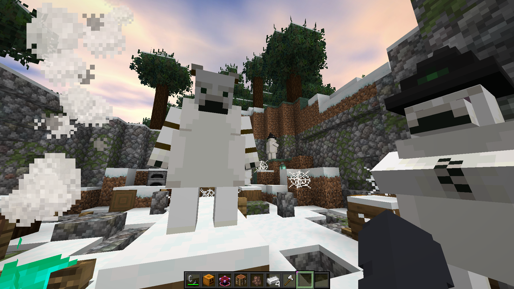
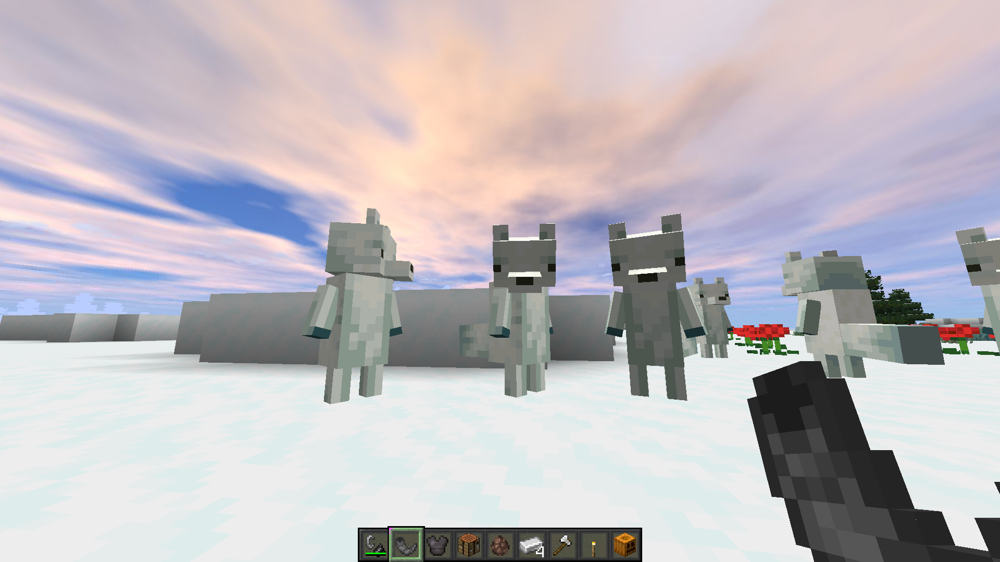
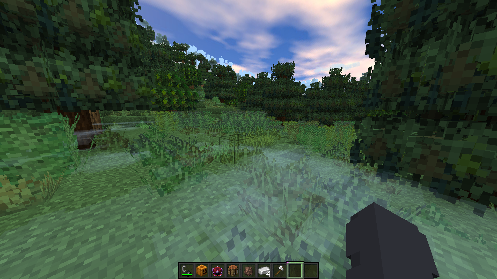

# Tadpole

## Screenshots

 

### Info
Tadpole is a fabric Modpack focused on performance, customization, aesthetics and cuteness. This pack uses a handful of well know QOL from modrinth and has opionated sensible defaults. There are no Mods in this pack which prevent joining vanilla servers.

This Pack uses presets from [Fabuously Optimised](https://modrinth.com/modpack/fabulously-optimized) which has optifine parity (support for capes, shaders, exteremely improved FPS etc.)

The most notable features:
  - We Dont Bite
  - Ears Mod (ears, tail, wings, muzzle etc.)
  - Cascades
  - Map/Minimap
  - Dark Mode
  - Skin Changer/Finder
  - Overylay Customizer (Configure fire effect and shield options)
  - Rain Customizer
  - Transparent Armor Customizer
  - Crafting Items Display
  - Block Info Display
  - Lighting Display
  - Crosshair Customizer

### Cheats and Cheating Policy
Considering the competitive policy `Anything which automates any player gameplay action is strictly disallowed`, this modpack has no such cheat which gains an unfair advantage. *The main exceptions* here may possibly be Better Third Person, which changes third person camera behavior on the client to be more accessible, and EMI which allows crafting by finding an item in its menu (In its cheat mode). Please see your servers cheat/modding policy to see if mods in this modpack voilate their rules. In prism launcher you can remove and disable any mod before launching. Please play fairly.

## Keybinds

| Action                                        | Key     |
|-----------------------------------------------|---------|
| Zoomify: Zoom                                 | `C`     |
| Advancements                                  | `O`     |
| Drop                                          | `G`     |
| Toggle Perspective                            | `Q`     |
| Custom Crosshair Mod: Open/Edit Crosshair GUI | `` ` `` |
| Command Keys: Edit                            | `P`     |
| Xaero: New Waypoint                           | `]`     |
| Xaero: Instant Waypoint                       | `[`     |
| Xaero: Waypoints                              | `\`     |
| Xaero: Minimap Zoom In                        | `=`     |
| Xaero: Minimap Zoom Out                       | `-`     |
| Xaero: Open Map                               | `M`     |
| Xaero: Toggle Minimap                         | `N`     |
| Xaero: Enlarge Map                            | `Z`     |
| Lighty: Toggle                                | `L`     |
| Jade: Show Overlay                            | `I`     |
| Show Me Your Skin: Toggle Transparent Armor   | `J`     |
| Show Me Your Skin: Show Customisation Menu    | `K`     |

